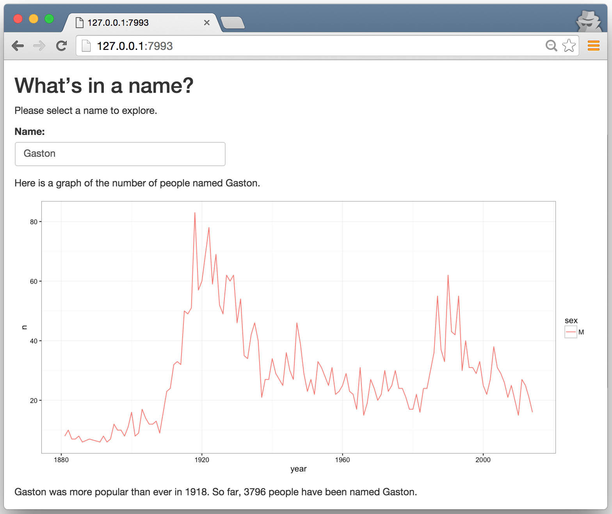

# Interactive Documents with R Shiny

Make sure you have installed the R packages `"ggplot2"` and `"babynames"`.

It is possible that you may need to install the following packages:
```R
install.packages(c("devtools", "ggplot2", "knitr", "yaml", "htmltools"))
devtools::install_github("hadley/babynames")
devtools::install_github("rstudio/shiny")
devtools::install_github("rstudio/rmarkdown")
```

### Practice

We'll be working with the data set `"babynames"`. Open a regular R script file and
add the following code (change your name!)
```R
library(babynames)

# subset babynames with your name
myname <- subset(babynames, name == "Gaston")

# find the most popular year for your name
myname$year[which.max(myname$n)]

# number of people with your name so far
sum(myname$n)
```

Now let's make a plot to see the trend of your name
```R
library(ggplot2)
qplot(year, n, data = myname, geom ="line", color = sex) +
theme_bw()
```

---

### Shiny

Shiny is an R package that does two things:

1. Creates __reactive__ R objects
2. Builds HTML web pages

Instead of using a plain R script, we'll generate an interactive document editing 
an Rmarkdown (.Rmd) file and using shiny. Open an interactive document in RStudio:

1. Go to __File__, click __New File__, then choose __R Markdown...__
2. Select __Shiny__, then __Shiny Document (default)__
3. Delete everything under the second `---`


### Reactive objects

Shiny provides two major types of reactive objects:

1. __Widgets__: let users set a value by typing, clicking, etc.
2. __Rendered__: respond whenever a widget value changes


### Creation of Widgets

Create a widget with a widget function. Since the function is R code, you'll need to put it in a code chunk

| Function        | Widget                                     |
| --------------- | ------------------------------------------ |
| actionButton    | Action Button                              |
| checkboxGroupIn | Group of checkboxes                        |
| checkboxInput   | Single checkbox                            |
| dateInput       | Calendar to aid date selection             |
| dateRangeInput  | Pair of calendars for selecting date range |
| fileInput       | File upload control wizard                 |
| helpText        | Help text to accompany other widgets       |
| numericInput    | Field to enter numbers                     |
| radioButtons    | Set of radio buttons                       |
| selectInput     | Box with choices to select from            |
| sliderInput     | Slide bar                                  |
| submitButton    | Submit button                              |
| textInput       | Field to enter text                        |

More info at: [Shiny Widgets Gallery](http://shiny.rstudio.com/gallery/widget-gallery.html)


### Shiny Interactive Document

In the Rmd file make sure you have the following yaml header and some title:

```bash
---
runtime: shiny
output: html_document
---

## What's in a name?
```

### Reactivity 101

The first thing to do is to include a widget that allows you to type some text (your name).
Use the __textInput()__ widget inside a code chunk: `textInput("name", label = "Name:", value = "Gaston")`

Your widget saves a value in R that you can call with `input$<inputId>`.
For example, let's say you have a `textInput` widget with the following call:
`textInput(inputId = "name", label = "Name:", value = "Gaston")`.
You would call the value of this widget with `input$name`.

The widget value changes whenever a user changes the widget.

You CANNOT call a widget value with a normal R function. For instance, 
if you try to this `nchar(input$name)` Shiny won't let you.


### Reactive expressions

You can use a reactive value in multiple render functions. 
Call a reactive values, as if it were a function.

| Function            | Creates       |
| ------------------- | ----------------- |
| `renderDataTable()` |	An interactive table |
| `renderImage()`     |	An image (saved as a link to a source file) |
| `renderPlot()`      |	A plot            |
| `renderPrint()`     |	A code block of printed output |
| `renderTable()`     |	A table            |
| `renderText()`      |	A character string |


### TO-DO

Use `renderPlor()` to display the plot
Use `renderText()` to display text

Try to replicate the following doc




